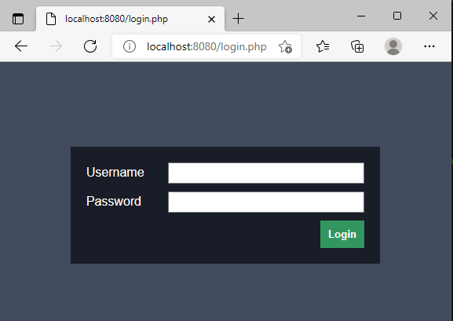

# Install

- [Set up the project files for reference](#set-up-the-project-files-for-reference)
- [Set your project for learning](#set-your-project-for-learning)

## Set up the project files for reference
1. Ensure that your system meets the [system requirements](requirements.md)
2. Download the latest release from [howtocodewell.net](https://howtocodewell.net)
3. Run composer install in the project directory
```bash
$ cd  ~/code/course-php-login
$ cd project
$ composer install
```

4. Run composer test to ensure the project has been created successfully
```bash
$ composer test
```

Your terminal output should look similar to this
```bash
$ composer test
> phpcs --standard=coding_standard.xml common.php tests public config
> phpstan
Note: Using configuration file /home/pfwd/code/course-php-login-master/project/phpstan.neon.
12/12 [▓▓▓▓▓▓▓▓▓▓▓▓▓▓▓▓▓▓▓▓▓▓▓▓▓▓▓▓] 100%


[OK] No errors


> phpunit --colors=always tests
PHPUnit 9.5.11 by Sebastian Bergmann and contributors.

Runtime:       PHP 8.0.14
Configuration: /home/pfwd/code/course-php-login-master/project/phpunit.xml

............                                                      12 / 12 (100%)

Time: 00:00.011, Memory: 6.00 MB

OK (12 tests, 12 assertions)
```

5. Run the PHP internal server to load the web page.
```bash
$ cd public
$ php -S localhost:8080
```
6. Go to [localhost:8080](http://localhost:8080) in your browser
You should see a webpage similar to this

 

## Set your project for learning

1.  Create a directory for your project
```bash
$ cd ~/code
$ mkdir project
```

2. Follow the instructions from [lesson 0](lessons/lesson_0.md)

[Go back to readme](../README.md)